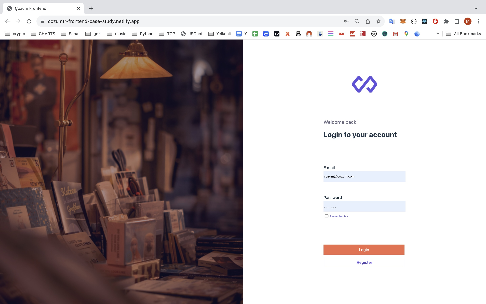
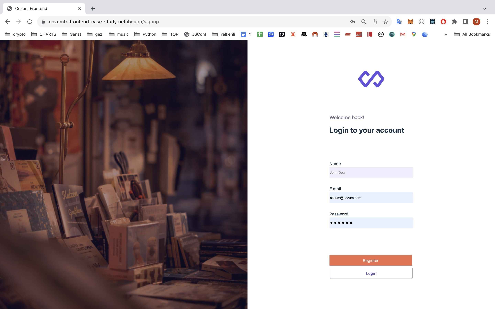
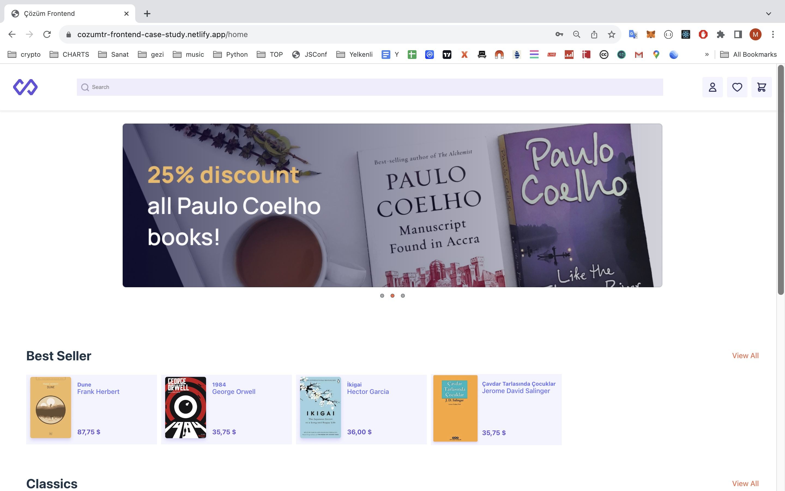
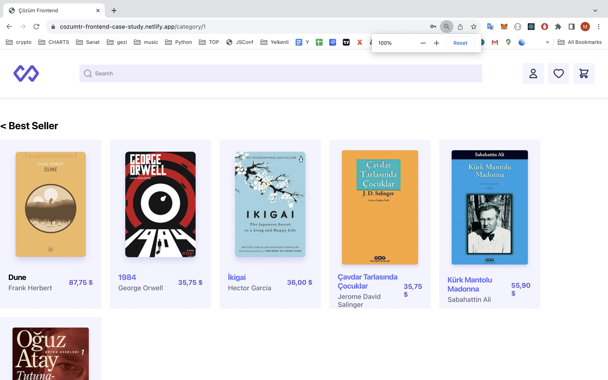
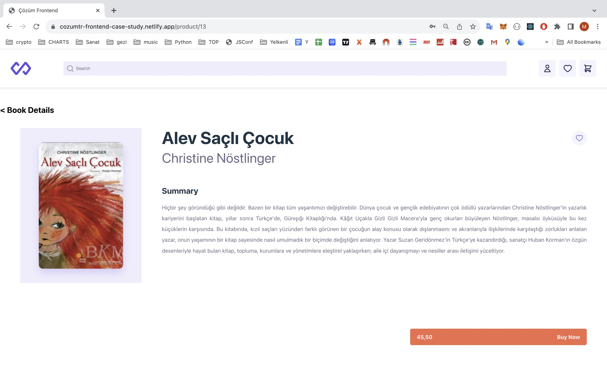

# ÇözümTR Frontend Case Study

In short, a book shopping website.

- When you enter the site, you will be greeted by the login page.
  - If you click the remember me box in the login form, the token from the server will be saved to local storage and used in your next entries to the site.
  - If you are not a member, you can go to the sing up page.
- After you fill out and submit the sign up form, a request is sent to the server to save your information and you are automatically redirected to the log in page.
- On the home page, book categories and the books belonging to these categories are displayed to the user after they are retrieved from the server and the data from the server is formatted appropriately.
- By clicking on the category titles, the user can go to the katori page and see only the books belonging to that category.
- By clicking on a book, the user can go to the book details page.

[Live Preview](https://cozumtr-frontend-case-study.netlify.app/)

## Setup

### Step 1: Dependency Installation

After cloning the repo execute :

```sh
npm install
```

### Step 2: Launching the Development Server

```sh
npm run dev
```

## Pictures

### Login



### Signup



### Home



### Category Detail



### Book Detail


